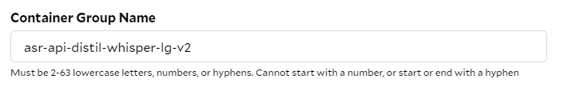
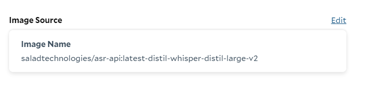
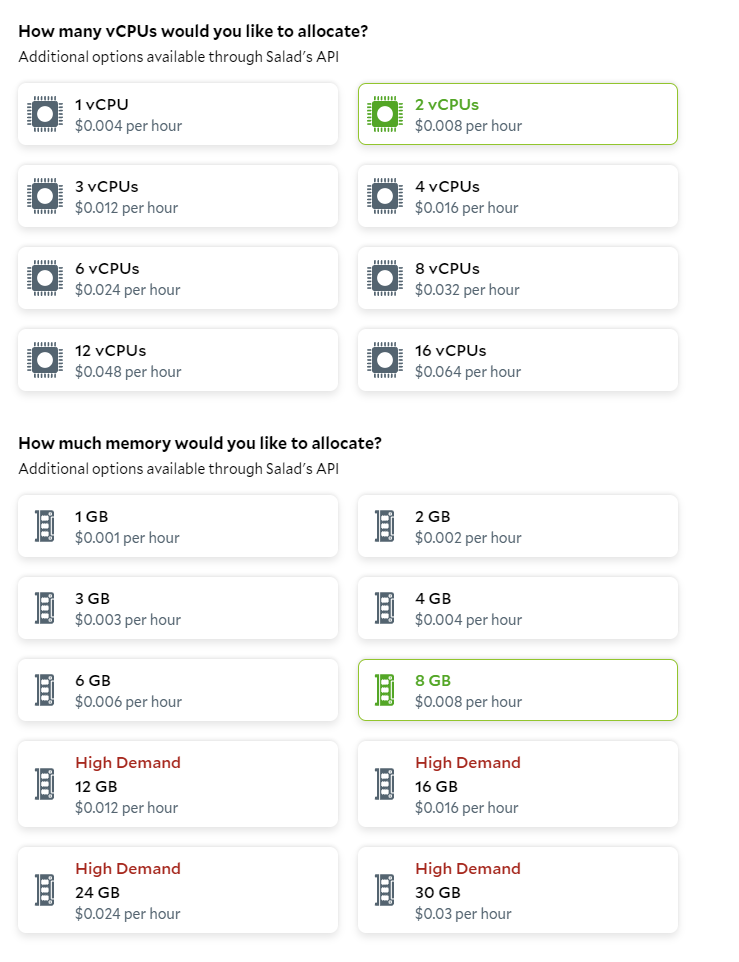
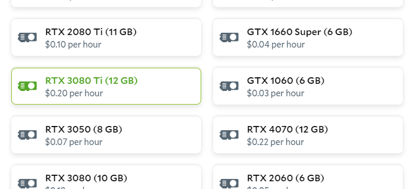
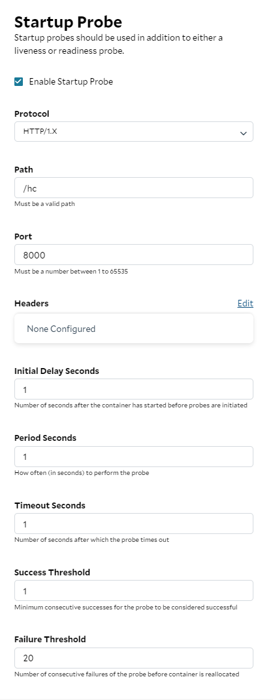
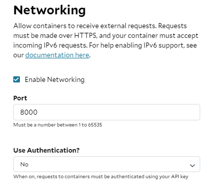

# Automatic Speech Recognition API

A minimalist, performance-oriented inference server for automatic speech recognition. 

Here's some prelimary performance numbers. These numbers are for total round-trip request time, including downloading the audio file, and parsing the response. The default configuration is used for all models.

More extensive benchmarks are available here:
- https://blog.salad.com/whisper-large-v3/
- https://blog.salad.com/distil-whisper-large-v2/

**RTX 3080 Ti w/ BetterTransformers**

| Model                                                                                   | Input Audio Length | Realtime Multiple |
| --------------------------------------------------------------------------------------- | ------------------ | ----------------- |
| [OpenAI Whisper Large v3](openai/whisper-large-v3)                                      | 19 min 51s         | 50x               |
| [Distil Whisper Distil Large v2](https://huggingface.co/distil-whisper/distil-large-v2) | 19 min 51s         | 78x               |

**RTX 4090 w/ BetterTransformers**

| Model                                                                                   | Input Audio Length | Realtime Multiple |
| --------------------------------------------------------------------------------------- | ------------------ | ----------------- |
| [OpenAI Whisper Large v3](openai/whisper-large-v3)                                      | 19 min 51s         | 68x               |
| [Distil Whisper Distil Large v2](https://huggingface.co/distil-whisper/distil-large-v2) | 19 min 51s         | 83x               |

**RTX 4090 w/ Flash Attention 2**

| Model                                                                                   | Input Audio Length | Realtime Multiple |
| --------------------------------------------------------------------------------------- | ------------------ | ----------------- |
| [OpenAI Whisper Large v3](openai/whisper-large-v3)                                      | 19 min 51s         | 63x               |
| [Distil Whisper Distil Large v2](https://huggingface.co/distil-whisper/distil-large-v2) | 19 min 51s         | 93x               |

## API

### GET /hc

This healthcheck will not respond until the server is fully ready to accept requests.

#### Response

```json
{
  "status": "ok",
  "version": "0.0.5",
}
```

### POST /asr

#### Request - JSON

URL should be a download link to an audio file. It can also be a local filepath, if the server is running on the same machine as the file. 

Verified extension support:
- mp3
- ogg
- wav
- webm
- flac

It may support more formats. It is using ffmpeg and Soundfile under the hood.

```json
{
  "url": "https://example.com/audio.mp3",
}
```

```json
{
  "url": "/path/to/local/audio.mp3"
}
```

#### Request - Upload

You can also upload an audio file directly. Use the raw bytes of the file as the request body.

**Python**

```python
with open(file_path, 'rb') as f:
    # Make the POST request, uploading the file's bytes directly
    response = requests.post(base_url + "/asr", data=f).json()
```

**CURL**

```shell
curl -X POST http://example.com/asr \
--data-binary @/path/to/your/audiofile.mp3 \
-H "Content-Type: application/octet-stream"
```

#### Response

```json
{
  "text": "hello world",
  "chunks": [
    {
      "timestamp": [
        0.0,
        2.1
      ],
      "text": "hello world"
    },
  ]
}
```

### GET /docs

Swagger docs for the API.

## Configuration

All configuration is via environment variables.

See documentation for the [ASR Pipeline](https://huggingface.co/docs/transformers/main/en/main_classes/pipelines#transformers.AutomaticSpeechRecognitionPipeline) for more information on the model configuration options:

| Name                | Description                                                                                                                                                                                          | Default                   |
| ------------------- | ---------------------------------------------------------------------------------------------------------------------------------------------------------------------------------------------------- | ------------------------- |
| `HOST`              | The host to listen on                                                                                                                                                                                | `*`                       |
| `PORT`              | The port to listen on                                                                                                                                                                                | `8000`                    |
| `MODEL_ID`          | The model to use. See [Automatic Speech Recognition Models](https://huggingface.co/models?pipeline_tag=automatic-speech-recognition&sort=trending)                                                   | `openai/whisper-large-v3` |
| `CACHE_DIR`         | The directory to cache models in                                                                                                                                                                     | `/data`                   |
| `FLASH_ATTENTION_2` | Whether to use flash attention 2. Must be `1` to enable. Enabled by default in `-fa2` images. Note, if your GPU does not support compute capability >= 8.9, BetterTransformers will be used instead. | **None**                  |
| `BATCH_SIZE`        | The batch size to use.                                                                                                                                                                               | `16`                      |
| `MAX_NEW_TOKENS`    | Not sure what this does.                                                                                                                                                                             | `128`                     |
| `CHUNK_LENGTH_S`    | The length of each chunk in seconds.                                                                                                                                                                 | `30`                      |
| `STRIDE_LENGTH_S`   | The stride length in seconds. Defaults to 1/6 of `CHUNK_LENGTH_S`                                                                                                                                    | `CHUNK_LENGTH_S` / 6      |


## Docker Images

> Note: The `-fa2` images are larger, and require a GPU with compute capability >= 8.9. If your GPU does not support this, use the non `-fa2` images.

- `saladtechnologies/asr-api:latest`, `saladtechnologies/asr-api:0.0.5` - The base image, no models included. Does not support flash attention 2, but is a smaller base image. Will download the model at runtime.
- `saladtechnologies/asr-api:latest-fa2` ,`saladtechnologies/asr-api:0.0.5-fa2` - The base image, no models included. Supports flash attention 2, but is a larger base image. Will download the model at runtime.
- `saladtechnologies/asr-api:latest-openai-whisper-large-v3`, `saladtechnologies/asr-api:0.0.5-openai-whisper-large-v3` - The base image, with the [OpenAI Whisper Large v3](openai/whisper-large-v3) model included. Does not support flash attention 2.
- `saladtechnologies/asr-api:latest-fa2-openai-whisper-large-v3`, `saladtechnologies/asr-api:0.0.5-fa2-openai-whisper-large-v3` - The base image, with the [OpenAI Whisper Large v3](openai/whisper-large-v3) model included. Supports flash attention 2.
- `saladtechnologies/asr-api:latest-distil-whisper-distil-large-v2`, `saladtechnologies/asr-api:0.0.5-distil-whisper-distil-large-v2` - The base image, with the [Distil Whisper Distil Large v2](https://huggingface.co/distil-whisper/distil-large-v2) model included. Does not support flash attention 2.
- `saladtechnologies/asr-api:latest-fa2-distil-whisper-distil-large-v2`, `saladtechnologies/asr-api:0.0.5-fa2-distil-whisper-distil-large-v2` - The base image, with the [Distil Whisper Distil Large v2](https://huggingface.co/distil-whisper/distil-large-v2) model included. Supports flash attention 2.

## Deploying On Salad

### Deploying with the API

You can deploy this API on Salad using the following command:
> See [API Docs](https://docs.salad.com/reference/create_container_group) for more information.

```bash
organization_name="my-org"
project_name="my-project"
salad_api_key="my-api-key"
curl -X POST \
  --url https://api.salad.com/api/public/organizations/${organization_name}/projects/${project_name}/containers \
  --header "Salad-Api-Key: ${salad_api_key}" \
  --data '
{
  "name": "asr-api-distil-whisper-lg-v2",
  "display_name": "asr-api-distil-whisper-lg-v2",
  "container": {
    "image": "saladtechnologies/asr-api:latest-distil-whisper-distil-large-v2",
    "resources": {
      "cpu": 2,
      "memory": 8192,
      "gpu_classes": [
        "65247de0-746f-45c6-8537-650ba613966a"
      ]
    },
    "command": [],
  },
  "autostart_policy": true,
  "restart_policy": "always",
  "replicas": 3,
  "networking": {
    "protocol": "http",
    "port": 8000,
    "auth": false
  },
  "startup_probe": {
    "http": {
      "path": "/hc",
      "port": 8000,
      "scheme": "http",
      "headers": []
    },
    "initial_delay_seconds": 1,
    "period_seconds": 1,
    "timeout_seconds": 1,
    "success_threshold": 1,
    "failure_threshold": 20
  }
}'
```

### Deploying With The Portal

You can also deploy this API on Salad using the [Salad Portal](https://portal.salad.com/).

Select or Create the organization and project you want to work with, then click the "Deploy a Container Group" button.

1. Give your container group a name that is unique within this organization and project.
   


2. Select the `saladtechnologies/asr-api:latest-distil-whisper-distil-large-v2` image to deploy distil-whisper large v2, using BetterTransformers.
   


3. Set your replica count. We recommend at least 3 replicas for production use.
   


4. Set the CPU to 2, and the memory to 8 GB.
   


5. Set the GPU to 1x RTX 3080 Ti (Or another GPU. We haven't done comprehensive testing on all GPUs, so your mileage may vary).
   


6. Configure the Startup Probe. This is used to determine when the container is ready to accept requests. Select the HTTP protocol, set the path to `/hc`, and the port to `8000`. Set the initial delay, period, and timeout to `1`. Set the success threshold to `1`, and the failure threshold to `20`. If you are using an image that downloads the model weights at runtime, you should increase intial delay to `10` or more, and a failure threshold of `180` to allow up to 3 minutes for the container to start.



7. Enable networking for port `8000`, and choose authenticated or not authenticated. If you choose authenticated, you will need to provide an API key when making requests.



8. Click "Deploy" to deploy your container group.


